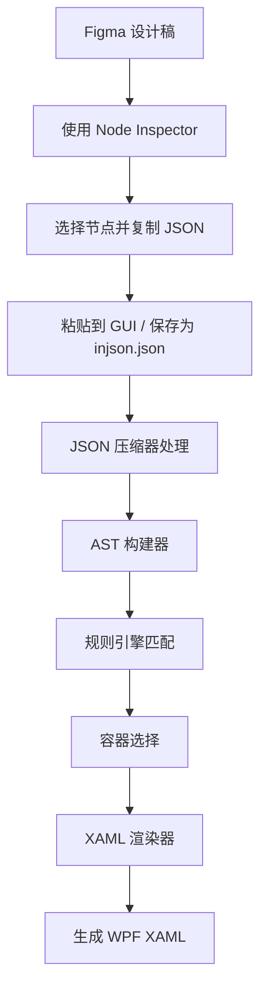

# 🎨 Figma to XAML Converter

一个功能强大的 Figma 设计稿到 WPF XAML 的转换工具，支持自动布局识别和智能容器选择。

> ⚠️ **注意**：当前版本为早期开发阶段，仅支持有限的 Figma 控件类型（FRAME、RECTANGLE、TEXT）。

## 📑 目录

- [✨ 特性](#-特性)
- [⚠️ 当前限制](#️-当前限制)
- [🚀 快速开始](#-快速开始5-分钟上手)
- [🏗️ 项目架构](#️-项目架构)
- [🔄 完整工作流程](#-完整工作流程)
- [📦 安装](#-安装)
- [🚀 使用方法](#-使用方法)
- [🎯 支持的布局类型](#-支持的布局类型)
- [📦 JSON 压缩器详解](#-json-压缩器详解)
- [🧪 测试](#-测试)
- [📝 配置文件](#-配置文件)
- [❓ 常见问题 FAQ](#-常见问题-faq)
- [📊 转换示例](#-转换示例)
- [🐛 已知问题](#-已知问题)

---

## ✨ 特性

- 🚀 **智能布局识别**：自动识别 Figma 的 Auto Layout 并转换为合适的 WPF 容器
- 🎯 **规则引擎驱动**：基于 YAML 配置的规则引擎，灵活可扩展
- 🏗️ **AST 架构**：使用抽象语法树 (AST) 架构，确保代码质量
- 📦 **JSON 压缩器**：智能压缩 Figma Node Inspector JSON，移除默认值和冗余属性
- 🖥️ **可视化 GUI**：提供友好的图形界面，支持实时预览
- ✅ **完整测试**：包含 11+ 个测试用例，确保转换准确性

## ⚠️ 当前限制

**支持的 Figma 控件类型**（仅限以下三种）：
- ✅ `FRAME` - 转换为 Border + 容器（Grid/StackPanel/WrapPanel）
- ✅ `RECTANGLE` - 转换为 Border
- ✅ `TEXT` - 转换为 TextBlock

**暂不支持**：
- ❌ `ELLIPSE`（椭圆）
- ❌ `LINE`（线条）
- ❌ `VECTOR`（矢量图形）
- ❌ `COMPONENT`（组件）
- ❌ `INSTANCE`（实例）
- ❌ 图片和图标
- ❌ 复杂样式（阴影、模糊等效果）

## 🚀 快速开始（5 分钟上手）

### 第一步：安装依赖

```powershell
pip install -r requirements.txt
```

### 第二步：从 Figma 获取 JSON

1. 打开 Figma 设计文件
2. 按 `Ctrl + /` 打开快速操作
3. 搜索并选择 **"Node Inspector"**
4. 在 Node Inspector 中**选择你的 Frame 节点**
5. 点击 **"Copy"** 复制 JSON
6. 保存为 `my_design.json`

### 第三步：使用 GUI 转换（推荐）

```powershell
python figma_to_xaml_gui.py
```

粘贴 JSON → 点击转换 → 复制 XAML ✅

**或者使用命令行**：

```powershell
# 1. 压缩 JSON
python figma_compressor.py my_design.json my_design_compressed.json

# 2. 转换为 XAML
python figma_to_xaml_v2.py my_design_compressed.json output.xaml
```

### 第四步：在 WPF 中使用

将生成的 XAML 代码复制到你的 WPF 项目中！

---

## 🏗️ 项目架构

```
figma2xaml/
├── 📁 src/                          # 核心源代码
│   ├── ast_builder.py              # AST 构建器（Figma → WPF AST）
│   ├── rule_engine.py              # 规则引擎（基于 YAML 配置）
│   ├── wpf_ast.py                  # WPF AST 节点定义
│   └── xaml_renderer.py            # XAML 渲染器（AST → XAML 字符串）
│
├── 📁 config/                       # 配置文件目录
│   ├── figma_wpf_mapping.yaml      # Figma 到 WPF 的映射规则
│   ├── layout_rules.yaml           # 布局选择规则
│   └── wpf_defaults.yaml           # WPF 默认值配置
│
├── 📁 test_cases/                   # 测试用例
│   ├── inputs/                     # 测试输入（压缩后的 Figma JSON）
│   ├── expected/                   # 预期输出（XAML）
│   └── outputs/                    # 实际输出（自动生成）
│
├── 🔧 figma_to_xaml_v2.py          # V2 转换器核心（命令行）
├── 🖥️ figma_to_xaml_gui.py         # GUI 应用程序（带自动压缩）
├── 📦 figma_compressor.py          # JSON 压缩工具 ⭐ 重要！
├── 🧪 run_tests.py                 # 自动化测试脚本
├── 📄 requirements.txt             # Python 依赖
│
├── 📝 injson.json                  # 示例：Node Inspector 原始输出
├── 📝 injson_compressed.json       # 示例：压缩后的 JSON
├── 📝 injson2.json                 # 其他测试用例
└── 📄 output.xaml                  # 示例：生成的 XAML 文件
```

**关键文件说明**：

| 文件 | 类型 | 说明 |
|-----|------|------|
| `figma_compressor.py` | 工具 | **必需**：压缩 Node Inspector JSON |
| `figma_to_xaml_v2.py` | 核心 | 转换器主程序（命令行） |
| `figma_to_xaml_gui.py` | GUI | 图形界面（推荐使用） |
| `injson*.json` | 示例 | Node Inspector 的原始输出 |
| `injson_compressed*.json` | 示例 | 压缩后的中间文件 |

## 🔄 完整工作流程



### 详细步骤说明

#### 1️⃣ 从 Figma 获取 JSON 数据

**重要**：JSON 数据来源于 **Figma Node Inspector** 插件/开发者工具。

**操作步骤**：
1. 在 Figma 中打开你的设计文件
2. 按 `Ctrl + /`（或 `Cmd + /`）打开快速操作
3. 搜索并启用 **"Node Inspector"** 或使用开发者模式
4. 在 Node Inspector 中**选择你要转换的节点**
5. 点击 **"Copy"** 按钮，复制该节点的 JSON 数据
6. 将复制的 JSON 数据保存为 `injson.json`（或直接粘贴到 GUI）

> 💡 **提示**：`injson.json`、`injson2.json` 等文件是从 Figma Node Inspector 复制的原始 JSON 数据。

#### 2️⃣ JSON 压缩（可选但推荐）

使用 `figma_compressor.py` 压缩 JSON：

```powershell
python figma_compressor.py injson.json injson_compressed.json
```

**压缩器的作用**：
- 移除 Figma 默认值（如 `visible: true`, `opacity: 1`）
- 删除可计算属性（如 `absoluteTransform`）
- 移除父节点引用，避免循环依赖
- 减小 JSON 文件大小 60-80%
- 提高转换速度和准确性

#### 3️⃣ AST 构建

将压缩后的 JSON 转换为 WPF AST（抽象语法树）：
- `FRAME` → 分析布局模式 → 选择容器类型
- `RECTANGLE` → 创建 Border 节点
- `TEXT` → 创建 TextBlock 节点

#### 4️⃣ 规则引擎匹配

根据 `config/layout_rules.yaml` 中定义的规则，选择最合适的 WPF 容器：
- 水平/垂直布局 → StackPanel
- 有 FILL 子元素 → Grid
- SPACE_BETWEEN → Grid（两端对齐）
- WRAP 模式 → WrapPanel

#### 5️⃣ XAML 渲染

使用 Python 字符串拼接生成最终的 XAML 代码。

## 📦 安装

### 前置要求

- Python 3.7+
- PySide2 (用于 GUI)
- PyYAML

### 安装步骤

```powershell
# 克隆仓库
git clone https://github.com/yourusername/figma2xaml.git
cd figma2xaml

# 安装依赖
pip install -r requirements.txt
```

## 🚀 使用方法

### 📋 前置步骤：获取 Figma JSON

1. **打开 Figma 设计文件**
2. **启用 Node Inspector**：
   - 按 `Ctrl + /` 或 `Cmd + /`（Mac）
   - 输入 "Node Inspector" 并选择
   - 或者：右键点击节点 → **"Copy as JSON"**（需要插件）
3. **选择要转换的节点**（Frame、Rectangle 或 Text）
4. **复制 JSON 数据**
5. **保存为 `injson.json`** 或直接使用

---

### 方法 1：图形界面（推荐）⭐

启动 GUI 应用程序：

```powershell
python figma_to_xaml_gui.py
```

**使用步骤**：
1. 从 Figma Node Inspector **复制 JSON 数据**
2. 粘贴到左侧输入框
3. **程序会自动压缩 JSON**（移除默认值）
4. 点击 **"转换"** 按钮
5. 在右侧查看生成的 XAML 代码
6. 点击 **"复制 XAML"** 使用生成的代码

> 💡 GUI 会自动调用压缩器，无需手动压缩！

---

### 方法 2：命令行（两步法）

#### 步骤 1：压缩 Figma JSON

```powershell
# 从 Node Inspector 复制的原始 JSON
python figma_compressor.py injson.json injson_compressed.json
```

**压缩示例**：
```
原始文件: injson.json (150 KB)
压缩后: injson_compressed.json (35 KB) ✅ 减小 77%
```

#### 步骤 2：转换为 XAML

```powershell
# 使用压缩后的 JSON
python figma_to_xaml_v2.py injson_compressed.json output.xaml
```

---

### 方法 3：Python API

```python
from figma_to_xaml_v2 import FigmaToXamlConverter
import json

# 初始化转换器
converter = FigmaToXamlConverter()

# 读取压缩后的 JSON
with open('injson_compressed.json', 'r', encoding='utf-8') as f:
    data = json.load(f)

# 转换
xaml = converter.convert_node(data, is_root=True)
print(xaml)
```

## 🎯 支持的布局类型

| Figma 布局 | WPF 容器 | 说明 |
|-----------|---------|------|
| `HORIZONTAL` | `StackPanel` | 水平排列，固定子元素 |
| `VERTICAL` | `StackPanel` | 垂直排列，固定子元素 |
| `HORIZONTAL` + FILL 子元素 | `Grid` | 水平布局，包含可伸缩元素 |
| `VERTICAL` + FILL 子元素 | `Grid` | 垂直布局，包含可伸缩元素 |
| `SPACE_BETWEEN` | `Grid` | 两端对齐布局 |
| `WRAP` | `WrapPanel` | 自动换行布局 |
| `NONE` | `Grid` | 绝对定位布局 |

## 📦 JSON 压缩器详解

### 为什么需要压缩？

从 Figma Node Inspector 复制的原始 JSON 包含大量冗余信息：

```json
// 原始 JSON (injson.json) - 150 KB
{
  "type": "FRAME",
  "visible": true,           // 默认值
  "locked": false,           // 默认值
  "opacity": 1,              // 默认值
  "blendMode": "PASS_THROUGH", // 默认值
  "effects": [],             // 默认值
  "reactions": [],           // 默认值
  "absoluteTransform": [...], // 可计算属性
  "parent": {...},           // 父节点引用（循环依赖）
  // ... 更多冗余属性
}
```

### 压缩器的功能

`figma_compressor.py` 会自动：

1. ✂️ **删除默认值**：移除所有等于 Figma 默认值的属性
2. 🗑️ **删除可计算属性**：如 `absoluteTransform`、`relativeTransform`
3. 🔗 **删除父节点引用**：避免循环依赖
4. 📊 **递归压缩**：处理所有嵌套的子节点
5. 📝 **生成报告**：输出压缩统计信息

### 使用示例

```powershell
# 压缩单个文件
python figma_compressor.py injson.json injson_compressed.json

# 查看输出
✅ 压缩完成！
📊 原始大小: 156,234 bytes
📊 压缩后: 38,567 bytes
📊 减少: 75.3%
📊 删除属性: 1,247 个
```

### 压缩前后对比

```json
// 压缩后 (injson_compressed.json) - 35 KB
{
  "type": "FRAME",
  "name": "ButtonGroup",
  "layoutMode": "HORIZONTAL",  // 非默认值，保留
  "itemSpacing": 16,           // 非默认值，保留
  "children": [...]            // 有内容，保留
}
```

### 压缩规则

基于 **Figma 官方文档**定义的默认值表（`FIGMA_DEFAULTS`）：

| 属性 | 默认值 | 说明 |
|-----|-------|------|
| `visible` | `true` | 可见性 |
| `locked` | `false` | 锁定状态 |
| `opacity` | `1` | 不透明度 |
| `rotation` | `0` | 旋转角度 |
| `blendMode` | `"PASS_THROUGH"` | 混合模式 |
| `effects` | `[]` | 效果列表 |
| `fills` | `[]` | 填充列表 |
| `strokes` | `[]` | 描边列表 |
| `cornerRadius` | `0` | 圆角半径 |
| ... | ... | 更多默认值请查看 `figma_compressor.py` |

### 注意事项

⚠️ **不压缩的关键属性**（即使等于默认值也保留）：
- `type` - 节点类型（必需）
- `name` - 节点名称（用于生成 x:Name）
- `width`、`height` - 尺寸信息
- `layoutMode` - 布局模式（关键）
- `children` - 子节点列表
- `gridRowSpan`、`gridColumnSpan` - Grid 布局信息

## 🧪 测试

### 运行所有测试

```powershell
python run_tests.py
```

### 运行单个测试

```powershell
python run_tests.py 01_horizontal_stack
```

### 测试用例列表

- ✅ `01_horizontal_stack` - 水平 StackPanel
- ✅ `02_vertical_stack` - 垂直 StackPanel
- ✅ `03_space_between` - 两端对齐 Grid
- ✅ `04_grid_layout` - Grid 网格布局
- ✅ `05_horizontal_fill` - 水平 FILL 布局
- ✅ `06_button_group` - 按钮组
- ✅ `07_range_input` - 范围输入控件
- ✅ `08_table_header` - 表格标题
- ✅ `09_form_row` - 表单行
- ✅ `10_nested_grid_hug_flex` - 嵌套 Grid（Hug + Flex）
- ✅ `11_complex_nested_grid` - 复杂嵌套 Grid

## 📝 配置文件

### `config/layout_rules.yaml`

定义布局选择规则：

```yaml
container_selection_rules:
  - name: "水平布局 + FILL 子元素 → Grid"
    conditions:
      layout_mode: "HORIZONTAL"
      has_fill_child: true
    container: "Grid"
    
  - name: "水平布局 + 固定子元素 → StackPanel"
    conditions:
      layout_mode: "HORIZONTAL"
      has_fill_child: false
    container: "StackPanel"
```

### `config/figma_wpf_mapping.yaml`

定义 Figma 到 WPF 的属性映射。

### `config/wpf_defaults.yaml`

定义 WPF 控件的默认值。

## 🔧 核心类说明

### `FigmaToXamlConverter`
主转换器类，协调整个转换流程。

```python
from figma_to_xaml_v2 import FigmaToXamlConverter

converter = FigmaToXamlConverter()
xaml = converter.convert_node(figma_json, is_root=True)
```

### `FigmaToWpfBuilder`
AST 构建器，将 Figma JSON 转换为 WPF AST。

### `RuleEngine`
规则引擎，根据 YAML 配置选择合适的容器。

### `XamlRenderer`
XAML 渲染器，将 AST 渲染为 XAML 字符串。

## 📊 转换示例

### 输入（Figma JSON）

```json
{
  "type": "FRAME",
  "name": "ButtonGroup",
  "layoutMode": "HORIZONTAL",
  "itemSpacing": 16,
  "children": [
    {
      "type": "RECTANGLE",
      "name": "Button1",
      "width": 100,
      "height": 40
    },
    {
      "type": "RECTANGLE",
      "name": "Button2",
      "width": 100,
      "height": 40
    }
  ]
}
```

### 输出（WPF XAML）

```xml
<Border Background="White" 
        BorderBrush="Transparent" 
        BorderThickness="0">
    <StackPanel Orientation="Horizontal" 
                Margin="0" 
                Spacing="16">
        <Border Width="100" Height="40" 
                Background="#D9D9D9" 
                x:Name="Button1"/>
        <Border Width="100" Height="40" 
                Background="#D9D9D9" 
                x:Name="Button2"/>
    </StackPanel>
</Border>
```

## 🐛 已知问题

查看 [BUGS_FOUND.md](BUGS_FOUND.md) 了解已知问题列表。
查看 [BUG_FIXES_SUMMARY.md](BUG_FIXES_SUMMARY.md) 了解修复记录。

## ❓ 常见问题 FAQ

### Q1: JSON 数据从哪里来？

**A**: JSON 数据来自 **Figma Node Inspector**，不是 Figma 导出功能！

**正确操作**：
1. 在 Figma 中打开设计文件
2. 按 `Ctrl + /` 打开快速操作
3. 搜索 "Node Inspector" 或使用开发者工具
4. **选择节点** → **复制 JSON**
5. 保存为 `injson.json`

**错误操作** ❌：
- 不要使用 Figma 的 "导出" 功能
- 不要使用 Figma REST API 的导出
- 不要手写 JSON

---

### Q2: 为什么我的控件转换失败？

**A**: 检查以下几点：

1. **控件类型是否支持？**
   - ✅ 支持：`FRAME`、`RECTANGLE`、`TEXT`
   - ❌ 不支持：`ELLIPSE`、`LINE`、`VECTOR`、`COMPONENT`、`INSTANCE`

2. **JSON 格式是否正确？**
   ```json
   // ✅ 正确：包含 type 字段
   {
     "type": "FRAME",
     "name": "MyFrame",
     ...
   }
   
   // ❌ 错误：缺少 type
   {
     "name": "MyFrame",
     ...
   }
   ```

3. **是否使用了压缩器？**
   - GUI 会自动压缩
   - 命令行需要手动运行 `figma_compressor.py`

---

### Q3: injson.json 和 injson_compressed.json 有什么区别？

**A**: 

| 文件 | 说明 | 大小 | 用途 |
|-----|------|------|------|
| `injson.json` | Node Inspector 原始输出 | ~150 KB | 输入文件（需压缩） |
| `injson_compressed.json` | 压缩后的 JSON | ~35 KB | 转换器输入文件 |
| `injson2.json`, `injson3.json` | 其他测试用的原始 JSON | 不定 | 开发测试 |

**工作流**：
```
injson.json (原始) 
    ↓ [figma_compressor.py]
injson_compressed.json (压缩)
    ↓ [figma_to_xaml_v2.py]
output.xaml (最终输出)
```

---

### Q4: 支持哪些 Figma 特性？

**A**: 

✅ **完全支持**：
- Auto Layout（水平/垂直/换行）
- 间距设置（itemSpacing、padding）
- 对齐方式（主轴、交叉轴）
- 填充和描边（纯色）
- 圆角
- 文本基本属性

⚠️ **部分支持**：
- 阴影（简单阴影）
- 渐变（转换为纯色）

❌ **不支持**：
- 图片和图标
- 复杂效果（模糊、外发光等）
- 组件和变体
- 原型交互
- 插件生成的内容

---

### Q5: 如何提高转换质量？

**A**: 

1. **在 Figma 中使用 Auto Layout**
   - 优先使用 Auto Layout 而不是绝对定位
   - 合理设置对齐和间距

2. **简化设计**
   - 使用基本形状（矩形、文本）
   - 避免复杂的矢量图形
   - 组件化重复元素

3. **规范命名**
   - 使用有意义的图层名称（会转为 `x:Name`）
   - 避免使用特殊字符

4. **测试驱动**
   - 先测试简单布局
   - 参考 `test_cases/` 中的示例
   - 逐步增加复杂度

---

### Q6: 生成的 XAML 需要手动调整吗？

**A**: **可能需要**。

**通常需要调整的部分**：
- 🎨 颜色值（从 Figma 设计规范复制）
- 📏 响应式布局（添加 MinWidth/MaxWidth）
- 🔧 数据绑定（添加 Binding）
- 🖱️ 事件处理（添加 Click 等事件）
- ✨ 动画效果（手动添加）

**不需要调整的部分**：
- ✅ 布局结构（Grid/StackPanel 选择准确）
- ✅ 对齐方式
- ✅ 间距设置
- ✅ 基本尺寸

---

### Q7: 为什么有这么多 injson*.json 文件？

**A**: 这些是开发测试文件：

- `injson.json` - 第一个测试案例
- `injson2.json` - 第二个测试案例
- `injson_compressed.json` - injson.json 的压缩版本
- `injson_compressed2.json` - injson2.json 的压缩版本
- ...

**你只需要**：
1. 从 Figma 复制 JSON → 保存为 `my_design.json`
2. 压缩：`python figma_compressor.py my_design.json my_design_compressed.json`
3. 转换：`python figma_to_xaml_v2.py my_design_compressed.json my_design.xaml`


## 📄 许可证

MIT License

## 🤝 贡献

欢迎提交 Issue 和 Pull Request！

### 贡献流程

1. Fork 本仓库
2. 创建特性分支 (`git checkout -b feature/AmazingFeature`)
3. 提交更改 (`git commit -m 'Add some AmazingFeature'`)
4. 推送到分支 (`git push origin feature/AmazingFeature`)
5. 开启 Pull Request

## 📧 联系方式

如有问题，欢迎创建 Issue 或联系项目维护者。

## 🙏 致谢

- 感谢 GitHub Copilot 提供的代码辅助
- 基于 Figma 官方 API 文档开发
- 使用 WPF/XAML 标准规范

---

**⭐ 如果这个项目对你有帮助，请给个 Star！**
